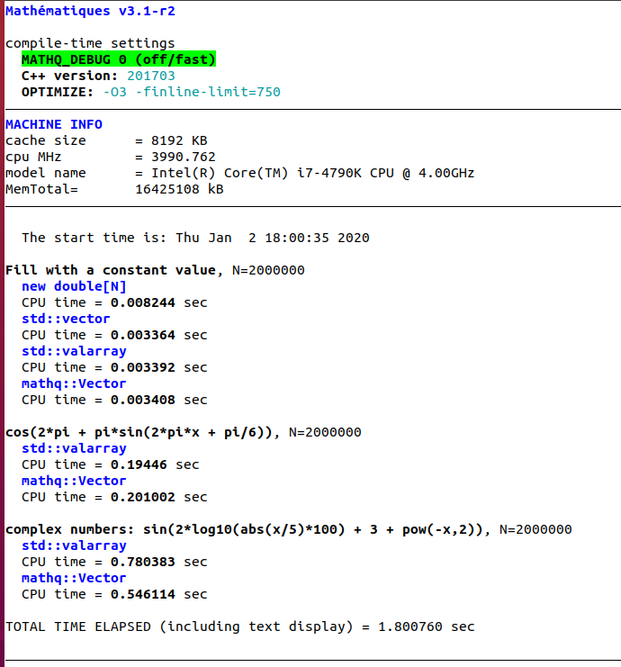

# 8-Benchmarks

-------------------------


| ⇦ <br />[7-User Guide](user-guide.md)  | <br />[Table Of Contents](toc.md)<br />  | ⇨ <br />[9-Tests](test.md)   |
| ----------- | ----------- | ----------- |


-------------------------

# 8-Benchmarks

_This document was automatically generated by doc/Makefile on 03 April 2022_


## Vector math benchmarks 

Here we compare _Mathematiques_ vs. a handcoded `C` array loops.

### mathq syntax 
```C++
Vector<double> x(N);
x = linspace<double>(0,1,N);
Vector<double> f(N);
start();
f = cos(2*pi + pi*sin(2*pi*x + pi/6));
stop();
```

### hand-coded `C` loop 
```C++
std::valarray<double> x(N);
for(int i=0; i<N; i++)
  x[i] = double(i)/double(N-1);
std::valarray<double> f(N);
start();
for(int i=0; i<N; i++)
     f[i] = cos(2*pi + pi*sin(2*pi*x[i] + pi/6));
stop();
```
### results




## dot product benchmarks
---------------------------------------------------------------------------
To be written...

| ⇦ <br />[7-User Guide](user-guide.md)  | <br />[Table Of Contents](toc.md)<br />  | ⇨ <br />[9-Tests](test.md)   |
| ----------- | ----------- | ----------- |
