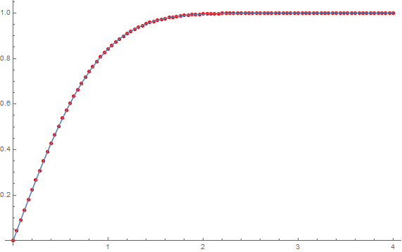

# Calculus in mātricks
_This document was automatically generated from file_ **`calculus.cpp`** (mātricks-v2.14-r7).

## Integration
### Definite integrals
Integrating over an interval [a,b] yields a single number--the area under the curve.


**EXAMPLE 1**: Definite integrals
```C++
const size_type N = 100000;
const double a = 0 + 1/double(N);
const double b = 1 - 1/double(N);
Vector<double> x(linspace<double>(a,b,N-1));
Vector<double> f;
f=-log(log(1/x));
```

Integrating f(x), as given above, yields the [Euler–Mascheroni](http://mathworld.wolfram.com/Euler-MascheroniConstant.html) constant whose exact value is `0.577215664901532...`.  The function _f_(_x_) is singular at both x=0 and x=1.  Thus we omitted these points. As the results show, this simple approach to the integral isn't particularly accurate. 

 

**Results**
```C++
  N = 100000; 
  a = 1e-05; 
  b = 0.99999; 
  integrate_a2b(f,a,b,0) = 0.577156; 
  integrate_a2b(f,a,b,1) = 0.577117; 
  integrate_a2b(f,a,b,2) = 0.577116; 
```

### Semi-Definite Integrals
A semi-definite integral is created by replacing one of the end points with _x_.


A semi-definite integral yields a function as its output.
Integration requires a cumulative sum.  Thus the caculation can not be accomplished via element-wise operations.  For this reasons these functions are performed in place, mimizing both memory usage and computation time.
All of the remaining functions discussed in this section modify the vector _in place_.


**EXAMPLE 2**:  The error function integral
The [error function](http://mathworld.wolfram.com/Erf.html) is the following semi-definite integral of the Gaussian function.


```C++
const size_type N = 101;
const double a = 0;
const double b = 4;
const double pi = 3.14159265358979323846;
Vector<double> x( linspace<double>(a,b,N) );
Vector<double> erf;
erf = 2/sqrt(pi)*exp(-sqr(x)/2);
erf.integrate_a2x(a,b,1);
set_mathematica_var_format();
```

The results _x_ and _f_(_x_) are:

```Mathematica
x = {
     0.00000000 10^+00,  4.00000000 10^-02,  8.00000000 10^-02,  1.20000000 10^-01,  1.60000000 10^-01, 
     2.00000000 10^-01,  2.40000000 10^-01,  2.80000000 10^-01,  3.20000000 10^-01,  3.60000000 10^-01, 
     4.00000000 10^-01,  4.40000000 10^-01,  4.80000000 10^-01,  5.20000000 10^-01,  5.60000000 10^-01, 
     6.00000000 10^-01,  6.40000000 10^-01,  6.80000000 10^-01,  7.20000000 10^-01,  7.60000000 10^-01, 
     8.00000000 10^-01,  8.40000000 10^-01,  8.80000000 10^-01,  9.20000000 10^-01,  9.60000000 10^-01, 
     1.00000000 10^+00,  1.04000000 10^+00,  1.08000000 10^+00,  1.12000000 10^+00,  1.16000000 10^+00, 
     1.20000000 10^+00,  1.24000000 10^+00,  1.28000000 10^+00,  1.32000000 10^+00,  1.36000000 10^+00, 
     1.40000000 10^+00,  1.44000000 10^+00,  1.48000000 10^+00,  1.52000000 10^+00,  1.56000000 10^+00, 
     1.60000000 10^+00,  1.64000000 10^+00,  1.68000000 10^+00,  1.72000000 10^+00,  1.76000000 10^+00, 
     1.80000000 10^+00,  1.84000000 10^+00,  1.88000000 10^+00,  1.92000000 10^+00,  1.96000000 10^+00, 
     2.00000000 10^+00,  2.04000000 10^+00,  2.08000000 10^+00,  2.12000000 10^+00,  2.16000000 10^+00, 
     2.20000000 10^+00,  2.24000000 10^+00,  2.28000000 10^+00,  2.32000000 10^+00,  2.36000000 10^+00, 
     2.40000000 10^+00,  2.44000000 10^+00,  2.48000000 10^+00,  2.52000000 10^+00,  2.56000000 10^+00, 
     2.60000000 10^+00,  2.64000000 10^+00,  2.68000000 10^+00,  2.72000000 10^+00,  2.76000000 10^+00, 
     2.80000000 10^+00,  2.84000000 10^+00,  2.88000000 10^+00,  2.92000000 10^+00,  2.96000000 10^+00, 
     3.00000000 10^+00,  3.04000000 10^+00,  3.08000000 10^+00,  3.12000000 10^+00,  3.16000000 10^+00, 
     3.20000000 10^+00,  3.24000000 10^+00,  3.28000000 10^+00,  3.32000000 10^+00,  3.36000000 10^+00, 
     3.40000000 10^+00,  3.44000000 10^+00,  3.48000000 10^+00,  3.52000000 10^+00,  3.56000000 10^+00, 
     3.60000000 10^+00,  3.64000000 10^+00,  3.68000000 10^+00,  3.72000000 10^+00,  3.76000000 10^+00, 
     3.80000000 10^+00,  3.84000000 10^+00,  3.88000000 10^+00,  3.92000000 10^+00,  3.96000000 10^+00, 
     4.00000000 10^+00
}; 
erf = {
     0.00000000 10^+00,  4.51171198 10^-02,  9.01621388 10^-02,  1.35063302 10^-01,  1.79749541 10^-01, 
     2.24150815 10^-01,  2.68198438 10^-01,  3.11825393 10^-01,  3.54966647 10^-01,  3.97559429 10^-01, 
     4.39543512 10^-01,  4.80861460 10^-01,  5.21458859 10^-01,  5.61284530 10^-01,  6.00290706 10^-01, 
     6.38433200 10^-01,  6.75671528 10^-01,  7.11969026 10^-01,  7.47292923 10^-01,  7.81614396 10^-01, 
     8.14908601 10^-01,  8.47154671 10^-01,  8.78335692 10^-01,  9.08438657 10^-01,  9.37454396 10^-01, 
     9.65377481 10^-01,  9.92206115 10^-01,  1.01794200 10^+00,  1.04259020 10^+00,  1.06615894 10^+00, 
     1.08865950 10^+00,  1.11010596 10^+00,  1.13051502 10^+00,  1.14990584 10^+00,  1.16829977 10^+00, 
     1.18572018 10^+00,  1.20219223 10^+00,  1.21774266 10^+00,  1.23239956 10^+00,  1.24619221 10^+00, 
     1.25915083 10^+00,  1.27130639 10^+00,  1.28269043 10^+00,  1.29333489 10^+00,  1.30327191 10^+00, 
     1.31253368 10^+00,  1.32115229 10^+00,  1.32915959 10^+00,  1.33658705 10^+00,  1.34346564 10^+00, 
     1.34982575 10^+00,  1.35569706 10^+00,  1.36110847 10^+00,  1.36608804 10^+00,  1.37066291 10^+00, 
     1.37485924 10^+00,  1.37870222 10^+00,  1.38221597 10^+00,  1.38542355 10^+00,  1.38834698 10^+00, 
     1.39100716 10^+00,  1.39342393 10^+00,  1.39561606 10^+00,  1.39760124 10^+00,  1.39939615 10^+00, 
     1.40101641 10^+00,  1.40247670 10^+00,  1.40379070 10^+00,  1.40497118 10^+00,  1.40603001 10^+00, 
     1.40697821 10^+00,  1.40782597 10^+00,  1.40858274 10^+00,  1.40925719 10^+00,  1.40985732 10^+00, 
     1.41039046 10^+00,  1.41086334 10^+00,  1.41128210 10^+00,  1.41165233 10^+00,  1.41197914 10^+00, 
     1.41226717 10^+00,  1.41252060 10^+00,  1.41274323 10^+00,  1.41293851 10^+00,  1.41310950 10^+00, 
     1.41325900 10^+00,  1.41338950 10^+00,  1.41350323 10^+00,  1.41360218 10^+00,  1.41368815 10^+00, 
     1.41376270 10^+00,  1.41382727 10^+00,  1.41388309 10^+00,  1.41393127 10^+00,  1.41397279 10^+00, 
     1.41400851 10^+00,  1.41403920 10^+00,  1.41406552 10^+00,  1.41408806 10^+00,  1.41410733 10^+00, 
     1.41412378 10^+00
}; 
```
Cut and paste the above data for `x` and `erf` into Mathematica as well as the following commands

```Mathematica
p1=ListPlot[Partition[Riffle[x,erf],2],PlotStyle->Red];
p2=Plot[Erf[0,x],{x,0,4}];
Show[p1,p2]
```
This yields the following plot comparing the results above [red dots] to the exact function [solid blue].

## Differentiation
 Differentiation requires points around it. For this reasons these functions are performed in place, mimizing both memory usage and computation time.


**EXAMPLE 3**: Derivatives
```C++
Vector<double> v1(5);
```

**Some expressions with results**
```C++
```

## Various related functions
All of these functions modify the vector _in place_.


**EXAMPLE 4**: Various functions: `cumsum`, `cumprod`, `cumtrapz`, `diff`, etc
```C++
set_default_format();
Vector<double> v1(5);
```

**Some expressions with results**
```C++
  v1 = {1,4,9,16,25} = {1,4,9,16,25}; 
  v1.cumsum() = {1,5,14,30,55}; 
  v1 = {1,4,9,16,25} = {1,4,9,16,25}; 
  v1.cumtrapz() = {0,2.5,9,21.5,42}; 
  v1 = {1,2,3,4,5} = {1,2,3,4,5}; 
  v1.cumprod() = {1,2,6,24,120}; 
  v1 = {1,4,9,16,25} = {1,4,9,16,25}; 
  v1.diff() = {3,3,5,7,9}; 
  v1 = {1,4,9,16,25} = {1,4,9,16,25}; 
  v1.diff(true) = {-24,3,5,7,9}; 
  v1 = {25,16,9,4,1} = {25,16,9,4,1}; 
  v1.cumsum_rev() = {55,30,14,5,1}; 
  v1 = {25,16,9,4,1} = {25,16,9,4,1}; 
  v1.cumtrapz_rev() = {42,21.5,9,2.5,0}; 
  v1 = {5,4,3,2,1} = {5,4,3,2,1}; 
  v1.cumprod_rev() = {120,24,6,2,1}; 
  v1 = {1,4,9,16,25} = {1,4,9,16,25}; 
  v1.diff_rev() = {3,5,7,9,9}; 
  v1 = {1,4,9,16,25} = {1,4,9,16,25}; 
  v1.diff_rev(true) = {3,5,7,9,-24}; 
```

The suffix `_rev` denote that the function starts at the highest element instead of the lowest element. Passing `true` to diff signifies that the function is periodic over the interval [a,b]. 

[Table of Contents](README.md)
